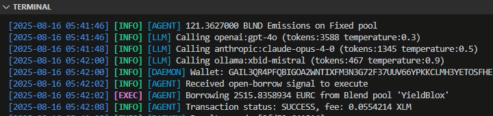
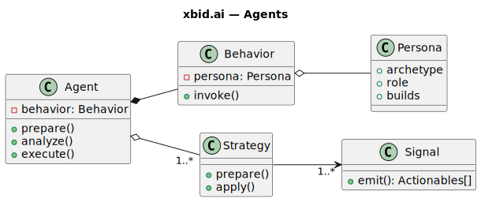

[](/LICENSE)
[](https://x.com/xbid_ai)
[](https://blog.xbid.ai)

> 🌱 **You found us early.** xbid.ai is under active development — sharpening its edge and scaling its stake as strategies prove themselves in live conditions.

# xbid.ai



Live at [**https://xbid.ai**](https://xbid.ai).

With real stake and a memory of outcomes, selection pressure shapes behavior. **xbid.ai** is an open experiment built on that premise.

**xbid.ai** is a **Multi-LLM AI agent** trading for real — executing delta-neutral strategies with AMM-hedged borrows, rebalancing collateral, and compounding recursive yield loops. Reinforcement routes receipts back into behavior, holding the agent to outcomes.

Open the terminal at [https://xbid.ai](https://xbid.ai) and watch the loop in motion.

## Built to Evolve

Whether trading for carry, running art auctions, or gaming competitively, the same loop generalizes beyond trading. The **xbid.ai** platform grows by design with new strategies, execution paths, and personas as its horizon expands.

If you are curious how the agent learns and adapts, we share that journey in the [xbid.ai blog](https://blog.xbid.ai) — from strategy design and reinforcement loops to the choices driving its growth.

## Architecture



The system is built on three core layers, each designed for modularity and extensibility:

* **Data Layer** — Ingests, normalizes and distills onchain and external data through pluggable adapters. Built for extension, this layer draws on sources like market flow metrics, sentiment analysis, exchange inflow/outflow patterns, and internal telemetry from the feedback adapter such as portfolio performance and HHI concentration (see [Live Data Sources](#live-data-sources)).
* **Strategy & Decision Engine** — Agents implement a persona-driven, multi-LLM inference system that transforms candidate signals into actions. Built on abstract interfaces for seamless strategy development. In production, xbid.ai applies mechanisms such as delta hedging via AMMs (see [`delta-neutral.js`](server/pipeline/agents/default/strategies/signals/delta-neutral.js)), collateral rebalancing, and recursive leverage loops tuned to opportunity cost.
* **Reinforcement Layer** — Captures structured user input to refine future decisions through gamified feedback loops. Participation in the `ai lab` is open, with every voice weighted, recorded, and verified onchain via smart contracts.

> Note: The Data Layer powers the `ai signal` API on our live platform — trading signals enriched with statistical context such as time-weighted averages, logarithmic returns, and trend slopes.

## LLM Support

The multi-LLM backend combines providers to suit strategy needs, performance, privacy, and cost profiles. One model drafts the initial inference, others critique. Our live agent works this way.

xbid.ai supports the following LLM providers, including **Ollama** for self-hosted models. New providers can be added by implementing them in `router.js`. Persona behaviors, build archetypes, instructions, and provider/model settings are customizable via the `Behavior` interface and `persona.yaml` in the `agent` folder.

| Provider      | Notes                                                               |
| ------------- | ------------------------------------------------------------------- |
| **OpenAI**    | GPT-5, GPT-4, GPT-4o, GPT-4.5, GPT-3.5... Requires `OPENAI_API_KEY`.       |
| **Anthropic** | Claude 4 Sonnet, Claude 4 Opus... Requires `ANTHROPIC_API_KEY`.     |
| **Ollama**    | Self-hosted models (LLaMA, Mistral, Gemma...). Configure host/port. |
| **Custom**    | Implement additional providers in `server/pipeline/router.js`.      |

> Audit trail: All LLM requests and responses (including provider, model, and context) are logged to SQLite `messages` table.

### Live Data Sources

[xbid.ai](https://xbid.ai) currently draws on these onchain and offchain sources to power its live trading decisions.

| **Category** | **Source**      | **Link**                                                             |
| ------------ | --------------- | -------------------------------------------------------------------- |
| **Onchain**  | Stellar Network | [stellar.org/developers](https://stellar.org/developers)             |
|              | Blend Capital   | [docs.blend.capital](https://docs.blend.capital/)                    |
|              | Stellar AMM     | [stellarx.com/amm/analytics](https://www.stellarx.com/amm/analytics) |
| **Offchain** | Alternative.me  | [api.alternative.me](https://api.alternative.me)                     |
|              | Santiment       | [santiment.net](https://santiment.net)                               |
|              | CoinGecko       | [coingecko.com](https://www.coingecko.com)                           |
|              | Binance API     | [developers.binance.com](https://developers.binance.com/)            |

## Configuration

Create a `.env` file in `/server` to configure the backend. Key variables:

| Variable            | Description                                               | Example Value           |
| ------------------- | --------------------------------------------------------- | ----------------------- |
| `XBID_WALLET`       | Stellar secret key for the wallet used by the agent.              | `S...ECRET`                 |
| `CONFIG`            | Config profile name (matches file in `server/config/`). | `default`               |
| `OPENAI_API_KEY`    | API key for OpenAI models.                                | `sk-...`                |
| `ANTHROPIC_API_KEY` | API key for Anthropic models.                             | `sk-ant-...`            |
| `PORT`              | Backend server port.                                      | `3000`                  |
| `CORS_ORIGIN`       | Comma-separated list of allowed origins.                  | `http://localhost:5173` |
| `AUTH_TOKEN`        | Optional opaque `Bearer` token for securing API requests.          | `secret123`           |
| `AGENT_NAME`        | Custom agent name          | `myagent`           | 

Additional pipeline parameters — such as ingester sources, distiller settings, custom strategy thresholds, and transaction parameters (e.g., slippage) — are configured in [`server/config/default.js`](server/config/default.js).  
To customize, copy this file into `server/config`, edit it as needed, and set the `CONFIG` environment variable to its filename.

## Getting Started

```bash
npm install
npm start
```

> The Node.js backend can run standalone. The frontend is lightweight, fast, and mobile-friendly (with PWA installation support) — built with [Vite](https://vite.dev) + [Lit](https://lit.dev).

## Source & License

The xbid.ai source is published under the [MIT License](LICENSE) for transparency, reference, and study.
You are free to fork, adapt, and use it under the terms of that license.
**The xbid.ai name, logo, and associated brand assets are trademarks of XBID LABS LLC and may not be used to represent derivative works without written permission.**
The live [xbid.ai](https://xbid.ai) service is developed and maintained by its original authors and copyrighted © 2025 XBID LABS LLC.

## Security Disclaimer

xbid.ai runs an autonomous agent. If you run your own instance, you are **solely responsible** for securing your environment, wallet, and API keys. Only deploy from trusted builds and consider using a dedicated wallet for live, development or testing. We do not operate, endorse, or monitor third-party deployments, and accept no liability for losses, bugs, or misconfigurations. Please read our [Terms of Use](https://xbid.ai/terms.txt).

---

## Links

- [Live Site](https://xbid.ai)
- [Twitter](https://x.com/xbid_ai)
- [Blog](https://blog.xbid.ai)